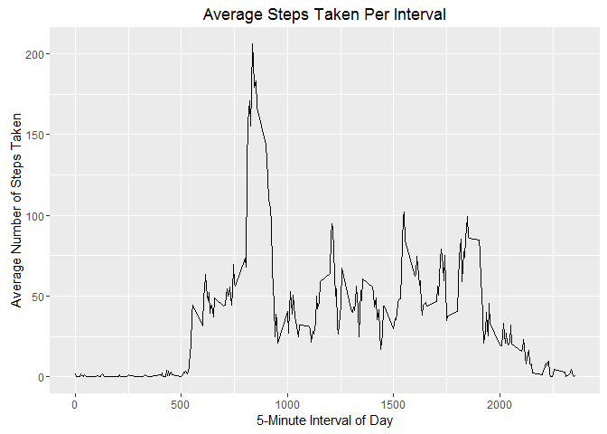
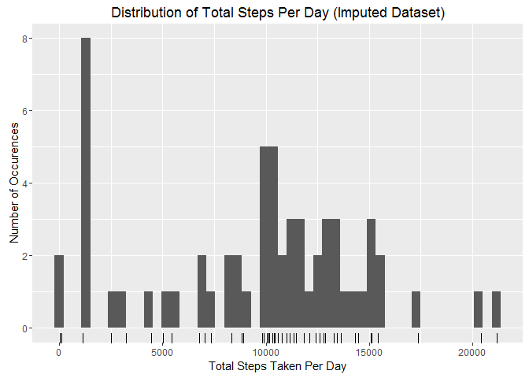

# Reproducible Research: Peer Assessment 1


## Loading and preprocessing the data

The following `R` code was used to load the packages, collect the data, and process the data. Regarding the packages: 

* `dplyr` is used for data frame manipulation during the tidying process
* `lubridate` is used for easy date manipulation
* `ggplot2` is used for processing the graphics/plots

The data was read usint `read.csv` and the `unz()` function was used to work with the zip file.

Tidying consisted of converting the date from `Factor` to `Date` class using the `ymd` function from `lubridate`. Additional columns were added for year, month, day and day of week using the appropriate `year`, `month`, `day`, `wday` functions from `lubridate`.


```r
# Load packages
library(lubridate)
library(dplyr)
library(ggplot2)

# Read data
rawData <- read.csv(unz("activity.zip", "activity.csv"), header=T)

# Convert Date and add year, month, day, day.of.week columns
tidyData <- rawData %>%
        mutate(date = ymd(date),
               year = year(date),
               month = month(date),
               day = day(date),
               day.of.week = wday(date))
```


## What is mean total number of steps taken per day?

The following `R` code calculates the total number of steps taken per day and reports the distribution in a histogram. A rugplot was added to further characterize the distribution density.


```r
# Calculate total steps per day
totalStepsPerDay.data <- tidyData %>%
        group_by(date) %>%
        summarize(total.steps = sum(steps, na.rm=T))

# Plot histogram
totalStepsPerDay.g <- ggplot(data=totalStepsPerDay.data, aes(x=total.steps))
totalStepsPerDay.g +
        geom_histogram(bins=50) +
        geom_rug() +
        ggtitle("Distribution of Total Steps Per Day") +
        xlab("Total Steps Taken Per Day") +
        ylab("Number of Occurences")
```

<!-- -->

The mean and median per day are calculated using the `mean` and `median` functions in the `R` code below.


```r
# Calculate mean of total daily steps
round(mean(totalStepsPerDay.data$total.steps),0)
```

```
## [1] 9354
```


```r
# Calculate median of total daily steps
median(totalStepsPerDay.data$total.steps)
```

```
## [1] 10395
```


## What is the average daily activity pattern?

The following `R` code calculates the average number of steps taken per 5-minute interval throughout the day, reported as a lineplot. 


```r
# Calculate average steps per interval
avgStepsPerInterval.data <- tidyData %>%
        group_by(interval) %>%
        summarize(avg.steps = mean(steps, na.rm=T))

# Plot lineplot
avgStepsPerInterval.g <- ggplot(data=avgStepsPerInterval.data, 
                                aes(x=interval, y=avg.steps))
avgStepsPerInterval.g + 
        geom_line() + 
        ggtitle("Average Steps Taken Per Interval") +
        xlab("5-Minute Interval of Day") +
        ylab("Average Number of Steps Taken")
```

<!-- -->

The following calculation finds the 5-minute interval with the most steps taken (on average).


```r
# Find the 5-minute interval with the maximum steps
maxRow <- which.max(avgStepsPerInterval.data$avg.steps)
avgStepsPerInterval.data[maxRow,]
```

```
## Source: local data frame [1 x 2]
## 
##   interval avg.steps
##      (int)     (dbl)
## 1      835  206.1698
```

## Imputing missing values

The following `R` code reports the total number of `NA`'s (aka missing values).


```r
# Total missing values
sum(is.na(tidyData$steps))
```

```
## [1] 2304
```

Strategy for imputing `NA`'s is based on replacing the `NA` with the median value for the time interval. 


```r
# Get median steps by interval
medianStepsByInterval <- tidyData %>%
        group_by(interval) %>%
        summarize(median.steps = median(steps, na.rm=T))

# Merge median by interval to data frame and use median where steps values are NA
imputedData <- tidyData %>%
        left_join(medianStepsByInterval, by="interval") %>%
        mutate(steps = ifelse(is.na(steps), median.steps, steps))
```

Histogram of the imputed dataset:


```r
# Calculate total steps per day from the imputed dataset
totalStepsPerDay.imputed.data <- imputedData %>%
        group_by(date) %>%
        summarize(total.steps = sum(steps))

# Plot histogram
totalStepsPerDay.imputed.g <- ggplot(data=totalStepsPerDay.imputed.data, aes(x=total.steps))
totalStepsPerDay.imputed.g +
        geom_histogram(bins=50) +
        geom_rug() +
        ggtitle("Distribution of Total Steps Per Day (Imputed Dataset)") +
        xlab("Total Steps Taken Per Day") +
        ylab("Number of Occurences")
```

<!-- -->

Calculate the mean and median daily steps from the imputed dataset:


```r
# Calculate mean of total daily steps
round(mean(totalStepsPerDay.imputed.data$total.steps),0)
```

```
## [1] 9504
```


```r
# Calculate median of total daily steps
median(totalStepsPerDay.imputed.data$total.steps)
```

```
## [1] 10395
```

The effect of using the median values to impute the `NA`'s has caused the mean to __increase__ while the median remains __unchanged__. The `NA`s are considered 0 in the original calculation, which can be seen in the previous histogram on the unimputed data. Adding the median shifted many of the `NA`'s to values greater than 0, which effectively increases the overall mean of the total steps data. There is no effect on the median because replacing the 0's with median values was not sufficient to change the overall median (i.e. the change in values were not large enough to change the overall median).  

## Are there differences in activity patterns between weekdays and weekends?

The following `R` Code adds an additional column `weekday` with either "weekday" or "weekend" depending on if the date is Monday through Friday or saturday/Sunday.


```r
# Add weekday column
imputedData <- imputedData %>%
        mutate(weekday = ifelse(day.of.week == 1 | day.of.week == 7, 
                                "weekend","weekday"))

imputedData$weekday <- as.factor(imputedData$weekday)
```

Panel plot of the time series of average number of steps on weekdays and weekends:


```r
# Calculate average steps by interval and weekday/weekend
weekdayVsWeekend.data <- imputedData %>%
        group_by(interval, weekday) %>%
        summarize(avg.steps = mean(steps))

# Plot data
weekdayVsWeekend.g <- ggplot(data=weekdayVsWeekend.data, 
                             aes(x=interval, y=avg.steps))
weekdayVsWeekend.g +
        geom_line() + 
        facet_grid(weekday~.)+
        ggtitle("Average Steps Taken Per Interval") +
        xlab("5-Minute Interval of Day") +
        ylab("Average Number of Steps Taken")
```

<!-- -->

